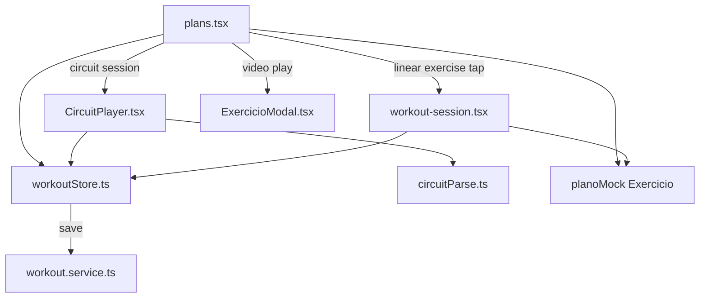

# Subagente 17c80b84

- **Arquivo origem:** `662ec52c-4257-4559-beb0-7c152a1e4c8f/subagents/17c80b84-8b45-4822-a34d-8ad04a164075.jsonl`
- **Exportado em:** 2026-07-08T07:50:39.479Z

---

## Usuário (1)

Explore the Kinevo Alunos React Native app at f:\Projeto_Kinevo\Kinevo_Alunos\src and find:

1. Read the full content of src/app/main/plans.tsx
2. Read the full content of src/components/CircuitPlayer.tsx (first 100 lines at minimum for structure)
3. Read the full content of src/utils/circuitParse.ts
4. Look for any ExerciseModal or similar component files in src/components/
5. Read src/store/workoutStore.ts
6. Check src/app/workout-session.tsx (first 80 lines)
7. Check what types/interfaces are defined for exercises (look for Exercise type definitions)

Return ALL file contents in full (or at least the key structural parts — imports, interfaces, main logic functions, render).

---

## Assistente (1)

Searching and reading the requested files across the Kinevo Alunos app.

---

## Assistente (2)

## Exploration Report — Kinevo Alunos `src/`

---

### 1. `f:\Projeto_Kinevo\Kinevo_Alunos\src\app\main\plans.tsx` (1294 lines — full file read)

**Purpose:** Workout plan list with non-linear flow, global Zustand timer, INICIAR/FINALIZAR TREINO, cards navigate to `workout-session` or open `CircuitPlayer`.

**Key imports:**
- `Exercicio` from `../../data/planoMock`
- `ExercicioModal`, `CircuitPlayer`
- `useTodayPlan`, `useWorkoutStore`, `isCircuitSession`, `buildCircuitSavedEntries`
- Workout history adapters and `saveCompletedWorkout`

**Sub-components:**
- `ExercicioPlanoCard` — exercise card with play button, metrics, completion footer
- `MetricCol` — label/value column

**Main screen logic (`PlansScreen`):**
- History mode via `historyDate` param
- Active session selection from `data.sessoes` + `activeSessionId` in Zustand
- Circuit detection → `openCircuitPlayer()` instead of `router.push("/workout-session")`
- `handleCircuitComplete` — builds entries via `buildCircuitSavedEntries`, calls `completeExercise` for each, saves to Firestore, `finishWorkout()`
- `handleFinalizarTreino` — validates with `canPersistWorkoutSession`, maps to saved entries, saves, invalidates queries
- Renders `FlatList` of exercises, session tabs, workout bar (timer / INICIAR / TREINO ATIVO)
- Modals: `ExercicioModal` (video), `CircuitPlayer` (circuit sessions)

---

### 2. `f:\Projeto_Kinevo\Kinevo_Alunos\src\components\CircuitPlayer.tsx` (943 lines — full file read)

**Purpose:** Full-screen modal circuit player with SETUP → WORK → REST phases.

**Key types:**
```typescript
type TimerMode = "countdown" | "free";
type PlayerPhase = "SETUP" | "WORK" | "REST";

export interface CircuitPlayerProps {
  visible: boolean;
  sessionTitle: string;
  exercises: Exercicio[];
  capTimeSeconds?: number;
  onWorkoutStart?: () => void;
  onClose: () => void;
  onComplete: (payload: { pse: number; totalSeconds: number }) => void;
}
```

**Sub-components:** `AlarmVolumeControl`, `TimeAdjuster`

**Main logic (`CircuitPlayer`):**
- Parses style via `detectCircuitStyle(sessionTitle)` and rounds via `resolveRoundsConfig`
- Suggested work/rest from `parseWorkSeconds(ex.reps)` / `parseRestString(ex.rest)`
- User-adjustable `userWorkSeconds` / `userRestSeconds` (0 = "Livre" / manual)
- Phases: SETUP (config lobby) → WORK → REST, with `useBackgroundAwareTimer` for main + total timers
- Auto-transitions on countdown zero with beeps (`useCircuitBeep`) + vibration
- PSE modal at end → `onComplete({ pse, totalSeconds })`
- Renders: header, setup scroll (time adjusters, alarm volume, exercise preview), active timer block, exercise list, footer CTA, nested PSE modal

---

### 3. `f:\Projeto_Kinevo\Kinevo_Alunos\src\utils\circuitParse.ts` (225 lines — full file read)

**Exported types:**
- `RestStrategy`: `fixed | emom | free | none`
- `CircuitStyle`: `circuit | emom | amrap | tabata | fortime | chipper | ladder | hiit | unknown`
- `RoundsConfig`: `{ total, isInfinite }`

**Exported functions:**
| Function | Role |
|----------|------|
| `parseRestString(raw)` | Parses rest strings (EMOM, min/s, bare numbers, "livre") |
| `resolveRestSeconds(strategy, workElapsed)` | Computes actual rest seconds (EMOM-aware) |
| `detectCircuitStyle(titulo?, tags?)` | Regex-based style from title/tags |
| `parseWorkSeconds(raw)` | Extracts work time from reps string |
| `resolveRoundsConfig(style, exercises, capTimeSeconds?)` | Determines round count per style |

---

### 4. Exercise modal components in `src/components/`

**No `ExerciseModal`** — the app uses **`ExercicioModal`** (Portuguese spelling).

| File | Purpose |
|------|---------|
| `f:\Projeto_Kinevo\Kinevo_Alunos\src\components\ExercicioModal.tsx` | Exercise detail modal: YouTube player, metrics, prof notes, student notes, "INICIAR EXERCÍCIO" |
| `f:\Projeto_Kinevo\Kinevo_Alunos\src\components\LegalTermsModal.tsx` | Unrelated legal terms |

**`ExercicioModal` props:**
```typescript
interface ExercicioModalProps {
  exercicio: Exercicio;
  planId: string;
  onClose: () => void;
  divisaoId?: string;
  onNoteSaved?: (exerciseId: string, texto: string) => void;
}
```

**Used in `plans.tsx`** when user taps play on a card (non-circuit sessions).

---

### 5. `f:\Projeto_Kinevo\Kinevo_Alunos\src\store\workoutStore.ts` (400 lines — full file read)

**Public types:**
```typescript
export interface SeriesLogEntry {
  setIndex: number;
  reps: number;
  weight: number;
}

export interface CompletedExercise {
  exerciseId: string;
  exercicioNome: string;
  actualPSE: number;
  totalExerciseTimeSeconds: number;
  seriesLog: SeriesLogEntry[];
  timestamp: number;
}
```

**State (`WorkoutState`):**
- `isWorkoutActive`, `globalTimerSeconds`, `completedExercises`, `sessionId`
- `activeDayNum`, `completedDayNums`, `activeSessionId`, `completedSessionIds`
- `currentSessionVolume`, `volumeDateKey`, `lastPlanId`

**Key actions:** `startWorkout`, `finishWorkout`, `tickGlobalTimer`, `syncGlobalTimer`, `completeExercise`, `abandonWorkout`, `markActiveDayCompleted`, `syncPlanFromServer`, `reset`

**Helpers exported:** `canPersistWorkoutSession`, `getTodayCompletedExercises`, `calcDailyVolume`, `calcAvgPse`, `calcInternalLoad`, `formatWeightKg`, `formatWorkoutTime`, `getMaxWeight`

---

### 6. `f:\Projeto_Kinevo\Kinevo_Alunos\src\app\workout-session.tsx` (1167 lines — first 80+ lines + structure read)

**Purpose:** Individual exercise session — set tracking, rest timer, active/total time, in-place next-exercise transition.

**Imports:** `Exercicio` from `planoMock`, `useBackgroundAwareTimer`, `useTodayPlan`, `useWorkoutStore`, `saveCompletedWorkout`

**Local types:**
```typescript
interface SerieEntry {
  setIndex: number;
  reps: number;
  weight: number;
  pse: number;
}
```

**Helpers:** `parseRepTarget`, `parseTimeTargetSeconds`, `getExerciseRepsMeta`, navigation helpers, `TimerRing` component

**`WorkoutSessionScreen` main flow:**
- Params: `exerciseId`, `divisaoId`
- Loads `exercises` from `planData.sessoes` or `microciclo.divisoes`
- State per exercise: reps, weight, PSE, `seriesLog`, exec timer (time-based exercises), rest timer, active/total time
- `handleFinalizarSerie` — logs set, starts rest
- `handleNextExercise` / `handleFinalizarExercicio` / `handleFinalizarTreino` — complete via Zustand + optional Firestore save
- Uses `useBackgroundAwareTimer` for exec, rest, active time, exercise total time

---

### 7. Exercise type definitions

#### Primary domain type — `f:\Projeto_Kinevo\Kinevo_Alunos\src\data\planoMock.ts`

```typescript
export type NivelDificuldade = "Iniciante" | "Intermediário" | "Avançado";
export type StatusExercicio = "ATIVO" | "MANUTENÇÃO" | "NOVO";

export interface Exercicio {
  id: string;
  nome: string;
  grupoMuscular: string;
  sets: number;
  reps: string;
  rest: string;
  nivel: NivelDificuldade;
  status: StatusExercicio;
  descricao: string;
  videoUrl: string;
  observacaoProf: string;
  anotacaoAluno: string;
}
```

Related hierarchy: `Divisao`, `Microciclo`, `PlanoDeTreino`, `DiaSessao` in same file.

#### Runtime/completion types — `workoutStore.ts`
- `SeriesLogEntry`, `CompletedExercise` (see section 5)

#### Persistence types — `f:\Projeto_Kinevo\Kinevo_Alunos\src\services\workout.service.ts`

```typescript
interface ExercicioRaw {  // internal Firestore adapter
  nome?: string;
  series?: string;
  reps?: string;
  intervalo?: string;
  // ... videoUrl, observacoes, etc.
}

export interface ExercicioConcluidoEntry {
  exerciseId?: string;
  nome: string;
  pseExercicio: number;
  tempoSegundos: number;
  series: SeriesLogSaved[];
  grupoMuscular?: string;
  concluido?: boolean;
}
```

#### Local session type — `workout-session.tsx`
- `SerieEntry` (includes per-set `pse`)

---

### Architecture summary



**Naming note:** There is no `Exercise` type — the canonical name is **`Exercicio`** (Portuguese). Completion tracking uses **`CompletedExercise`** in Zustand and **`ExercicioConcluidoEntry`** for Firestore persistence.

---
