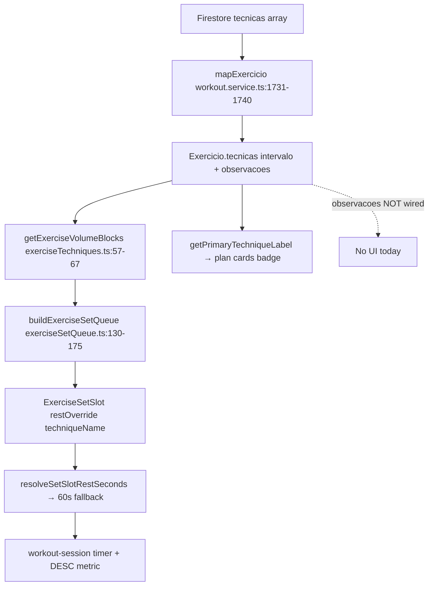

# Subagente 559dac1a

- **Arquivo origem:** `662ec52c-4257-4559-beb0-7c152a1e4c8f/subagents/559dac1a-47ca-4085-bcb5-5ec925bca69c.jsonl`
- **Exportado em:** 2026-07-16T18:39:46.605Z

---

## Usuário (1)

Explore F:/Projeto_Kinevo/Kinevo_Alunos for how exercise techniques (tecnicas) are consumed:
1. Type definitions for tecnicas (intervalo, observacoes fields)
2. Firebase/API mappers that read tecnicas
3. Exercise card components (plans list) - where HIIT/Drop-Set badges show
4. Workout execution screen (workout-session.tsx) - where technique info displays
5. Where rest/interval defaults to 60s when intervalo is missing

Return exact file paths, line numbers, and what needs to change to display technique.observacoes and use technique.intervalo for rest.

---

## Assistente (1)

Exploring the Kinevo_Alunos codebase for how exercise techniques are defined, mapped, and displayed.

---

## Assistente (2)

# How `tecnicas` Are Consumed in Kinevo_Alunos

## 1. Type definitions (`intervalo`, `observacoes`)

| File | Lines | What it defines |
|------|-------|-----------------|
| `F:/Projeto_Kinevo/Kinevo_Alunos/src/utils/exerciseTechniques.ts` | 18–24 | `ExerciseTechnique` — canonical type with `metodo`, `volume`, `serie`, **`intervalo`**, **`observacoes`** |
| `F:/Projeto_Kinevo/Kinevo_Alunos/src/data/planoMock.ts` | 45–51 | `Exercicio.tecnicas[]` — same fields on the mobile domain model |
| `F:/Projeto_Kinevo/Kinevo_Alunos/src/services/workout.service.ts` | 795–801 | `ExercicioRaw.tecnicas[]` — Firestore raw shape |
| `F:/Projeto_Kinevo/Kinevo_Alunos/src/utils/exercisePrescription.ts` | 25–31 | `RawExercisePrescription.tecnicas[]` — week-resolution helper type |

Related execution types:

```36:37:F:/Projeto_Kinevo/Kinevo_Alunos/src/utils/exerciseSetQueue.ts
  /** Descanso específico da técnica (ex.: intervalo do Drop-Set). */
  restOverride?: string;
```

```26:31:F:/Projeto_Kinevo/Kinevo_Alunos/src/utils/exerciseTechniques.ts
export interface ExerciseVolumeBlock {
  kind: "normal" | "technique";
  series: number;
  repsRaw: string;
  techniqueName?: string;
  restOverride?: string;
}
```

**Gap:** `observacoes` is typed everywhere but never propagated into `ExerciseVolumeBlock` or `ExerciseSetSlot`.

---

## 2. Firebase / API mappers

### Primary mapper — `mapExercicio`

```1668:1740:F:/Projeto_Kinevo/Kinevo_Alunos/src/services/workout.service.ts
function pickRestInterval(raw: ExercicioRaw): string {
  return pickRestIntervalFromRecord(raw as Record<string, unknown>);
}
// ...
    rest: sanitizeText(pickRestInterval(raw)) || "60s",
// ...
    ...(Array.isArray(raw.tecnicas) && raw.tecnicas.length > 0
      ? {
          tecnicas: raw.tecnicas.map((t) => ({
            ...t,
            metodo: String(t?.metodo ?? "").trim(),
            volume: String(t?.volume ?? "").trim(),
            serie: t?.serie ?? "",
            intervalo: pickRestIntervalFromRecord(t as Record<string, unknown>),
            observacoes: String(t?.observacoes ?? "").trim(),
          })),
        }
      : {}),
```

- Exercise-level `observacoes` → `observacaoProf` (line 1726).
- Technique-level `intervalo` is normalized via `pickRestIntervalFromRecord`.
- Technique-level `observacoes` is stored on `Exercicio.tecnicas[]` but **never read by UI**.

### Rest field reader (exercise + technique)

```104:122:F:/Projeto_Kinevo/Kinevo_Alunos/src/utils/circuitParse.ts
export function pickRestIntervalFromRecord(
  raw: Record<string, unknown> | null | undefined
): string {
  // reads: intervalo, descanso, rest, restTime, tempo_descanso, pausa
}
```

### Volume-block builder (technique → rest override)

```57:67:F:/Projeto_Kinevo/Kinevo_Alunos/src/utils/exerciseTechniques.ts
  for (const t of exercise.tecnicas ?? []) {
    // ...
    blocks.push({
      kind: "technique",
      // ...
      restOverride:
        pickRestIntervalFromRecord(t as Record<string, unknown>) || undefined,
    });
  }
```

### Fingerprint (techniques in sync key, but not `observacoes`/`intervalo` per technique)

```3009:3031:F:/Projeto_Kinevo/Kinevo_Alunos/src/services/workout.service.ts
  const tecnicas = Array.isArray(ex.tecnicas)
    ? ex.tecnicas.map((t) => t.metodo ?? "").join("+")
    : "";
```

---

## 3. Plan list cards — HIIT / Drop-Set badges

Two card components render technique badges from **`metodo` only** (first technique with `serie > 0`):

### `ExercicioPlanoCard` (single exercises)

```221:258:F:/Projeto_Kinevo/Kinevo_Alunos/src/app/main/plans.tsx
  const techniqueLabel = useMemo(() => getPrimaryTechniqueLabel(item), [item]);
  // ...
            {techniqueLabel ? (
              <View style={pl.techniqueBadge}>
                <Text style={pl.techniqueBadgeText} numberOfLines={1}>
                  {techniqueLabel}
                </Text>
              </View>
            ) : null}
```

DESC column uses **exercise-level** `item.rest` (line 279), not technique interval.

### `GroupedExerciseCard` (supersets)

```117:158:F:/Projeto_Kinevo/Kinevo_Alunos/src/components/GroupedExerciseCard.tsx
  const techniqueLabel = useMemo(() => getPrimaryTechniqueLabel(item), [item]);
  // badge renders techniqueLabel
  // DESC uses item.rest (lines 105–115, 180–184)
```

### Badge source helper

```153:161:F:/Projeto_Kinevo/Kinevo_Alunos/src/utils/exerciseTechniques.ts
export function getPrimaryTechniqueLabel(exercise: {
  tecnicas?: ExerciseTechnique[];
}): string | null {
  const match = (exercise.tecnicas ?? []).find(
    (t) => parseTechniqueSetCount(t.serie) > 0 && String(t.metodo ?? "").trim()
  );
  return match ? String(match.metodo).trim() : null;
}
```

REPS column condenses technique volume via `resolveExerciseCardRepsColumn` (`volumeMetric.ts` 71–120) — still no `observacoes` or technique rest.

---

## 4. Workout execution — `workout-session.tsx`

### Set queue + technique slots

```1750:1784:F:/Projeto_Kinevo/Kinevo_Alunos/src/app/workout-session.tsx
  const setQueue = useMemo(
    () => (exercicio ? buildExerciseSetQueue(exercicio) : []),
    [exercicio?.aquecimento, exercicio?.preparatorias, exercicio?.sets, exercicio?.reps, exercicio?.tecnicas]
  );
  const currentSetSlot = setQueue[seriesConcluidas] ?? null;
```

### Technique label in UI (name + drop phase)

```4688:4699:F:/Projeto_Kinevo/Kinevo_Alunos/src/app/workout-session.tsx
                : currentSetSlot.setType === "technique"
                  ? (() => {
                      const name = (currentSetSlot.techniqueName || "TÉCNICA").toUpperCase();
                      if (currentSetSlot.techniquePhase && currentSetSlot.techniquePhaseCount > 1) {
                        return `${name} T${currentSetSlot.techniqueSetIndex}.${currentSetSlot.techniquePhase} · ...`;
                      }
                      return `${name} ${currentSetSlot.workingSetNumber ?? ""}`.trim();
                    })()
```

### Rest resolution during execution (technique interval **already wired**)

```1925:1943:F:/Projeto_Kinevo/Kinevo_Alunos/src/app/workout-session.tsx
  const prescribedRestSeconds = useMemo(
    () => resolveSetSlotRestSeconds(currentSetSlot, exercicio?.rest),
    [exercicio?.rest, currentSetSlot]
  );
  const plannedRestDisplay = useMemo(
    () => resolvePlannedRestDisplay(exercicio?.rest, prescribedRestSeconds),
    [exercicio?.rest, prescribedRestSeconds]
  );
```

Post-set rest trigger:

```3522:3604:F:/Projeto_Kinevo/Kinevo_Alunos/src/app/workout-session.tsx
      if (isIntraTechniquePhase) {
        const intraRestSec = resolveSetSlotRestSeconds(completedSlot, activeExercise?.rest);
        // ...
      }
      const restAfterSetSec = resolveSetSlotRestSeconds(completedSlot, activeExercise?.rest);
      // ...
      beginRestCountdown(restAfterSetSec);
```

DESC metric in prescribed row:

```4730:4736:F:/Projeto_Kinevo/Kinevo_Alunos/src/app/workout-session.tsx
            <Text style={s.prescribedMetricVal}>
              {prescribedRestSeconds > 0
                ? `${prescribedRestSeconds}s`
                : exercicio?.rest ?? ""}
            </Text>
            <Text style={s.prescribedMetricLbl}>DESC.</Text>
```

### What is **not** shown in workout-session

- `technique.observacoes` — **nowhere**
- `exercicio.observacaoProf` — only in `ExercicioModal.tsx` (364–377), not on the execution screen
- `formatVolumeBlocksSummary` — defined but **unused** in any component

Student notes use `WorkoutObservacaoField` (4833–4842) — aluno notes, not technique/professional notes.

---

## 5. Where rest defaults to 60s when `intervalo` is missing

| File | Lines | Behavior |
|------|-------|----------|
| `F:/Projeto_Kinevo/Kinevo_Alunos/src/utils/exerciseSetQueue.ts` | 193, 196–209 | `DEFAULT_REST_FALLBACK_SECONDS = 60`; `resolveSetSlotRestSeconds`: slot `restOverride` → exercise rest → **60** |
| `F:/Projeto_Kinevo/Kinevo_Alunos/src/services/workout.service.ts` | 1720 | `rest: pickRestInterval(raw) \|\| "60s"` on every mapped exercise |
| `F:/Projeto_Kinevo/Kinevo_Alunos/src/utils/exercisePrescription.ts` | 281 | `rest: pickRestInterval(raw) \|\| "60s"` |
| `F:/Projeto_Kinevo/Kinevo_Alunos/src/app/workout-session.tsx` | 122, 1994–1996, 2013–2016 | `BASE_REST_PRESETS` includes 60; initial `restDuration` state = 60; reset uses `resolveExerciseRestSeconds(exercicio.rest) \|\| 60` |

**Important:** During technique slots, if `technique.intervalo` is empty, `resolveSetSlotRestSeconds` falls back to **`exercicio.rest`** (which is already `"60s"` from the mapper), so the timer still gets 60s even though the technique had no interval.

---

## What needs to change

### A. Display `technique.observacoes`

**Data layer (minimal propagation):**

1. **`exerciseTechniques.ts` ~26–31, 60–67** — add `observacoes?: string` to `ExerciseVolumeBlock`; copy from `t.observacoes` in `getExerciseVolumeBlocks`.
2. **`exerciseSetQueue.ts` ~16–38, 141–174** — add `techniqueObservations?: string` to `ExerciseSetSlot`; set from `block.observacoes` when building technique slots.
3. Optional helper in `exerciseTechniques.ts`:
   ```ts
   resolveTechniqueObservations(exercise, techniqueName?: string): string
   ```

**UI layer:**

4. **`workout-session.tsx` ~4683–4701** — below the technique set-type label, render `currentSetSlot.techniqueObservations` (or lookup from `exercicio.tecnicas`) in a collapsible card, mirroring `ExercicioModal`’s “Observações do Profissional” pattern (364–387).
5. **Optional plan cards** — `plans.tsx` ExercicioPlanoCard (~253–259) and `GroupedExerciseCard.tsx` (~152–158): show truncated technique notes under the badge when `getPrimaryTechniqueLabel` matches a technique with non-empty `observacoes`.
6. **Optional modal** — `ExercicioModal.tsx` (~364): append technique-specific notes when `exercicio.tecnicas` has `observacoes`.

### B. Use `technique.intervalo` for rest (execution + cards)

**Execution is mostly done** — verify Firebase sends `intervalo` (or alias keys read by `pickRestIntervalFromRecord`). If rest still shows 60s on technique sets, the data is likely empty at source, not a missing code path.

**Gaps to fix for correct display:**

1. **Plan cards DESC column** — `plans.tsx` line 279 and `GroupedExerciseCard.tsx` lines 105–115 / 180–184 always show `item.rest`. Change to something like:
   - normal sets → `item.rest`
   - when `getPrimaryTechniqueLabel(item)` → show primary technique’s `intervalo` (or `"—"` if absent, instead of inheriting 60s silently)
2. **`workout-session.tsx` ~4730–4736** — when `currentSetSlot?.isTechnique`, label could clarify “DESC. TÉCNICA” and show `prescribedRestSeconds` derived from technique (already computed via `restOverride`).
3. **If you want no 60s fallback for technique-only exercises** — adjust `resolveSetSlotRestSeconds` in `exerciseSetQueue.ts` 196–209 to accept a flag or return `0` when on a technique slot with no `restOverride`, instead of falling through to exercise rest / 60.

### C. Suggested change map (minimal diff)

```
exerciseTechniques.ts   → propagate observacoes into blocks
exerciseSetQueue.ts     → propagate observacoes + restOverride onto slots (rest already OK)
workout-session.tsx     → render techniqueObservations; DESC label for technique slots
plans.tsx               → optional: technique interval in DESC column
GroupedExerciseCard.tsx → same as plans card
```

No mapper changes needed for reading — `mapExercicio` already maps both fields correctly at `workout.service.ts` 1731–1740.

---

## Data flow diagram



If you want this implemented, switch to Agent mode and I can apply the targeted changes above.

---
