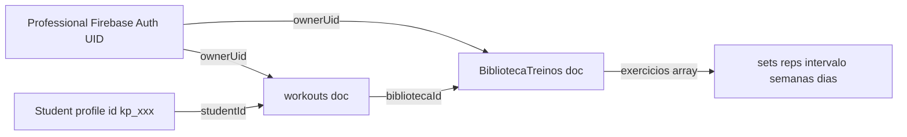

# Subagente 5a71deba

- **Arquivo origem:** `662ec52c-4257-4559-beb0-7c152a1e4c8f/subagents/5a71deba-59d0-443f-a461-e6de894dee4f.jsonl`
- **Exportado em:** 2026-07-16T18:35:22.594Z

---

## Usuário (1)

Explore the web project at f:\Projeto_Kinevo\Kinevo_v2 to map the Firestore data structure used for workout plans/training plans for students/alunos.

Specifically, search for:
1. Firestore collection names where training plans (treinos/planos/workouts) are stored
2. The document structure/fields (exercise name, sets, reps, rest, etc.)
3. How users/alunos are linked to their plans (by UID, email, etc.)
4. Any security rules file (firestore.rules or similar)
5. Look in app.js, any kinevo-runtime.js, or any other JS files

The main files to check are:
- f:\Projeto_Kinevo\Kinevo_v2\app.js (8306 lines)
- f:\Projeto_Kinevo\Kinevo_v2\index.html (7940 lines)

Search for patterns like: collection(, firestore, db., treino, plano, workout, aluno, exercicio, where(, getDocs, addDoc, setDoc

Return:
- The exact Firestore collection paths found
- The field names in documents (especially for workout/plan documents)
- How the student UID is used in queries
- Any sub-collection structure

Be thorough and specific - include code snippets found.

---

## Assistente (1)

Mapping Firestore workout-plan structure in Kinevo_v2 — searching JS files and security rules for collections, fields, and student links.

---

## Assistente (2)

Searching for where full workout content (exercises, sets, reps) is stored — likely in the biblioteca layer.

---

## Assistente (3)

# Firestore data structure for workout/training plans in Kinevo_v2

Kinevo_v2 splits training data across **three layers**: the full plan content in **`BibliotecaTreinos`**, student assignments in **`workouts`**, and student profiles in **`perfisAlunos`**. There is also a separate exercise media library at **`ExerciciosBanco/{uid}/exercicios`**.

`kinevo-runtime.js` has **no Firestore usage** — it is UI-only (custom selects, etc.).

---

## Architecture overview



- **Full workout content** (exercises, sets, reps, rest, periodization) → `BibliotecaTreinos/{docId}` (via Cloud Function, not direct client Firestore).
- **Per-student assignment** (which fichas belong to which aluno) → `workouts/{docId}` (direct Firestore from `exerciseProfileManager.js`).
- **Student identity** → `perfisAlunos/{docId}` with a client-generated `id` like `kp_...` (not Firebase Auth UID).

---

## 1. Firestore collection paths

| Collection path | Role | How accessed from Kinevo_v2 |
|-----------------|------|------------------------------|
| **`BibliotecaTreinos/{docId}`** | Master training fichas (full plan) | Cloud Function `gerenciarBibliotecaTreinos` via `fnBiblioteca` |
| **`PerfisTreino/{docId}`** | Custom training profile templates (nome, tags) | Cloud Function `gerenciarPerfisTreino` |
| **`workouts/{docId}`** | Treinos assigned to a student | Direct Firestore in `features/exerciseProfileManager.js` |
| **`perfisAlunos/{docId}`** | Student CRM profiles | Direct Firestore in `features/userProfileActions.js` |
| **`ExerciciosBanco/{uid}/exercicios/{docId}`** | Exercise media library (not plans) | Direct Firestore in `app.js` |
| **`contasAlunos/{uid}`** | Future student login mapping | Rules only in `Kinevo_v2/firestore.rules` (no client writes) |

**Sub-collections:** only `ExerciciosBanco/{uid}/exercicios`. Training plans use **embedded arrays**, not sub-collections.

**Storage (not Firestore):**
- Videos: `uploads/{uid}/biblioteca_treinos/{treinoId}/...`
- Exercise media: `ExerciciosBanco/{uid}/{docId}/video|imagem`

---

## 2. `BibliotecaTreinos` — full plan documents

CRUD is in `Kinevo Pro/functions/index.js` (`gerenciarBibliotecaTreinos`). Kinevo_v2 calls it through:

```45:45:f:\Projeto_Kinevo\Kinevo_v2\core\kinevoCallableGateway.js
        fnBiblioteca: (payload) => call("gerenciarBibliotecaTreinos", payload),
```

### Top-level document fields

From the Cloud Function `create` action:

| Field | Type / notes |
|-------|----------------|
| `ownerUid` | Professional's Firebase Auth UID |
| `nome` | Ficha name (max 120) |
| `pasta` | Folder/category (lowercase) |
| `objetivo` | Goal text |
| `observacoes` | Long text (up to 250k chars) |
| `tags` | `string[]` |
| `perfilId` | From `perfil_id` in payload |
| `perfilNome` | From `perfil_nome` |
| `exercicios` | **Array of exercise objects** (see below) |
| `dieta` | Optional: `objetivo`, `calorias`, `proteina`, `carboidrato`, `gordura`, `orientacoes`, `restricoes` |
| `status` | `"ativo"` / `"arquivado"` |
| `version` | Number, incremented on update |
| `createdAt`, `updatedAt` | `serverTimestamp()` |
| `createdAtIso`, `updatedAtIso` | ISO strings |
| `shareEnabled`, `shareToken` | Public share link |
| `sourceTreinoId` | Set on duplicate |

### `exercicios[]` item fields (normalized server-side)

```2015:2036:f:\Projeto_Kinevo\Kinevo Pro\functions\index.js
        const normalizarExercicios = (lista) => lista.map((x) => ({
            nome: coerceText(x?.nome, 120),
            fase: coerceText(x?.fase, 80),
            mesociclo_label: coerceText(x?.mesociclo_label, 80),
            semana_num: x?.semana_num != null ? Number(x.semana_num) || 1 : 1,
            semana_label: coerceText(x?.semana_label, 40),
            dia_treino: coerceText(x?.dia_treino, 80),
            foco: coerceText(x?.foco, 80),
            series: coerceText(x?.series, 20),
            reps: coerceText(x?.reps, 40),
            intervalo: coerceText(x?.intervalo, 20),
            metodo: coerceText(x?.metodo, 80),
            progressao: coerceText(x?.progressao, 120),
            regressao: coerceText(x?.regressao, 120),
            observacoes: coerceText(x?.observacoes, 220),
            protocolo_cardio: coerceText(x?.protocolo_cardio, 4000),
            videoUrl: coerceText(x?.videoUrl, 500),
            aquecimento: coerceText(x?.aquecimento, 20),
            preparatorias: coerceText(x?.preparatorias, 20),
            superset_id: coerceText(x?.superset_id, 80),
            tecnicas: normalizarTecnicas(x?.tecnicas)
        })).filter((x) => x.nome);
```

**Rest/pause** is stored as **`intervalo`** (not `descanso` or `rest` — those names appear only in import/export parsing in `app.js`).

**`tecnicas[]` items:** `metodo`, `volume`, `serie`, `observacoes`.

Default new exercise in the visual editor (`app.js`):

```3080:3087:f:\Projeto_Kinevo\Kinevo_v2\app.js
            const novoEx = {
                nome: "", fase: _kinevoFaseAtiva || "", mesociclo_label: _kinevoFaseAtiva || "",
                semana_num: _kinevoSemanaAtiva || 1, semana_label: `Semana ${_kinevoSemanaAtiva || 1}`,
                dia_treino: dia,
                foco: "", series: "3", reps: "12", intervalo: "", metodo: "",
                progressao: "", regressao: "", observacoes: "", protocolo_cardio: "", videoUrl: "",
                aquecimento: "0", preparatorias: "0", tecnicas: [], superset_id: ""
            };
```

### Queries

List is scoped by professional UID server-side:

```2252:2254:f:\Projeto_Kinevo\Kinevo Pro\functions\index.js
        let query = db.collection("BibliotecaTreinos").where("ownerUid", "==", ownerUid);
        if (statusFiltro) query = query.where("status", "==", statusFiltro);
        const snap = await query.limit(200).get();
```

Client-side filters (pasta, objetivo, perfil_nome, tags) are applied in memory after fetch (`app.js` → `atualizarListaTreinosBiblioteca`).

---

## 3. `workouts` — student-assigned treinos (references only)

Defined in `features/exerciseProfileManager.js`:

```29:29:f:\Projeto_Kinevo\Kinevo_v2\features\exerciseProfileManager.js
const FS_COL     = "workouts";          // nome da coleção no Firestore
```

### Document fields

| Field | Purpose |
|-------|---------|
| `ownerUid` | Professional's Firebase Auth UID |
| `studentId` | Student profile id (`kp_...` from `perfisAlunos`) |
| `nome` | Display name (often from biblioteca ficha) |
| `data` | Assignment date string |
| `categoria` | `"Livre"`, `"Musculação"`, `"Cardio"`, `"Funcional"` |
| `id`, `localId` | Client-generated treino id |
| `bibliotecaId` | Link to `BibliotecaTreinos` doc id |
| `bibliotecaNome` | Fallback name for lookup |
| `origem` | Usually `"biblioteca"` |

**No `exercicios`, `series`, or `reps` in `workouts`** — only metadata + biblioteca link.

### Query pattern

```81:85:f:\Projeto_Kinevo\Kinevo_v2\features\exerciseProfileManager.js
                const q = query(
                    collection(window.db, FS_COL),
                    where("ownerUid", "==", ownerUid),
                    where("studentId", "==", alunoAtualId)
                );
```

`alunoAtualId` = `window.kinevoAlunoAtualId`, set when editing a student profile:

```203:203:f:\Projeto_Kinevo\Kinevo_v2\features\userProfileActions.js
            window.kinevoAlunoAtualId = p.id;
```

### localStorage fallback

Key: `kinevo_treinos_{studentId}` when Firestore is unavailable.

---

## 4. How students/alunos are linked

There are **three different identifiers** — do not confuse them:

| Identifier | What it is | Used for |
|------------|------------|----------|
| **`perfisAlunos.id`** | Client id `kp_{timestamp}_{random}` | `workouts.studentId`, `tarefas.alunoId`, UI state `kinevoAlunoAtualId` |
| **`perfisAlunos._docId`** | Firestore document id | Persistence in `perfisAlunos` collection |
| **`ownerUid`** | Professional's Firebase Auth UID | Ownership on all collections |
| **Student email** | Stored on profile (`email`, `emailMini`) | Display/contact only — **not used in Firestore queries** |
| **`contasAlunos/{authUid}`** | Planned student login bridge | `studentId` + `ownerUid` for future student app read of `workouts` |

Student profile fields saved to `perfisAlunos`:

```244:261:f:\Projeto_Kinevo\Kinevo_v2\features\userProfileActions.js
            const dados = {
                id:        _perfilEditando || gerarId(),
                nome:      v("kpu-nome"),
                sobrenome: v("kpu-sobrenome"),
                objetivos: v("kpu-objetivos"),
                telefone:  v("kpu-telefone"),
                email:     v("kpu-email") || v("kpu-email-mini"),
                emailMini: v("kpu-email-mini") || v("kpu-email"),
                endereco:  v("kpu-cep"),
                cep:       v("kpu-cep"),
                cidade:    v("kpu-cidade"),
                pais:      document.getElementById("kpu-pais")?.value || "",
                bio:       v("kpu-bio"),
                sobre:     v("kpu-sobre"),
                website:   v("kpu-website"),
                foto:      foto.startsWith("data:") ? foto : "",
                atualizadoEm: new Date().toISOString(),
            };
```

Query for profiles:

```61:61:f:\Projeto_Kinevo\Kinevo_v2\features\userProfileActions.js
                const q = query(collection(_db, FS_COL), where("ownerUid", "==", _uid));
```

**Linking flow:** professional imports a biblioteca ficha into a student → `workouts` doc created with `studentId` + `bibliotecaId` → opening "Editar" resolves the full plan via `bibliotecaId` → `getTreino` on `BibliotecaTreinos`.

---

## 5. `ExerciciosBanco` — exercise library (not training plans)

Sub-collection path:

```7657:7666:f:\Projeto_Kinevo\Kinevo_v2\app.js
    function _colRef() {
        const uid = _uid();
        if (!uid) throw new Error("Usuário não autenticado");
        return collection(_db(), "ExerciciosBanco", uid, "exercicios");
    }

    function _docRef(id) {
        const uid = _uid();
        if (!uid) throw new Error("Usuário não autenticado");
        return doc(_db(), "ExerciciosBanco", uid, "exercicios", id);
```

Document fields: `nome`, `descricao`, `status`, `tipoMidia`, `videoUrl`, `youtubeUrl`, `imagemUrl`, `grupamentos[]`, `criadoEm`, `atualizadoEm`.

---

## 6. Security rules

### Deployed from Kinevo_v2: `f:\Projeto_Kinevo\Kinevo_v2\firestore.rules`

Includes student read access for `workouts` via `contasAlunos`:

```17:31:f:\Projeto_Kinevo\Kinevo_v2\firestore.rules
    function studentAccount() {
      return get(/databases/$(database)/documents/contasAlunos/$(request.auth.uid));
    }

    function isLinkedStudent() {
      return signedIn()
        && exists(/databases/$(database)/documents/contasAlunos/$(request.auth.uid))
        && studentAccount().data.ativo != false;
    }

    function isStudentWorkout() {
      return isLinkedStudent()
        && resource.data.studentId == studentAccount().data.studentId
        && resource.data.ownerUid == studentAccount().data.ownerUid;
    }
```

```70:74:f:\Projeto_Kinevo\Kinevo_v2\firestore.rules
    match /workouts/{docId} {
      allow create: if createsOwnDoc();
      allow read: if isOwnerByField() || isStudentWorkout();
      allow update, delete: if isOwnerByField();
    }
```

**Note:** `Kinevo_v2/firestore.rules` does **not** define rules for `BibliotecaTreinos` or `PerfisTreino` (those are accessed via Admin SDK in Cloud Functions). The older `Kinevo Pro/firestore.rules` has client rules for those collections, but Kinevo_v2 does not use direct client Firestore for biblioteca CRUD.

`contasAlunos` — read-only for the student; writes blocked:

```76:79:f:\Projeto_Kinevo\Kinevo_v2\firestore.rules
    match /contasAlunos/{uid} {
      allow read: if signedIn() && request.auth.uid == uid;
      allow write: if false;
    }
```

---

## 7. Other related collections (not plan content)

| Collection | Link to training |
|------------|------------------|
| `tarefas` | Calendar tasks with `alunoId` (= `perfisAlunos.id`) |
| `mensagensWhatsApp` | Templates; references students from `perfisAlunos` |
| `anamneses` | Clinical forms, `ownerUid` |
| `perfisUsuario/{uid}` | Professional's own profile |

---

## 8. Local caches (not Firestore)

| Key | Content |
|-----|---------|
| `kinevo_editor_exercicios_v1` | In-progress biblioteca editor exercises |
| `kinevo_editor_semana_v1` / `kinevo_editor_dia_v1` | Editor UI state |
| `kinevo_treinos_{studentId}` | Fallback student workout list |
| `kinevo_perfis_lista_{uid}` | Fallback student profiles |

---

## Summary for Kinevo_Alunos integration

If you are building the student app:

1. **Read assigned treinos:** query `workouts` where `studentId` matches `contasAlunos/{authUid}.studentId` (requires `contasAlunos` docs to exist).
2. **Read full plan content:** you need either:
   - Cloud Function access to `BibliotecaTreinos` (today only via `gerenciarBibliotecaTreinos` with professional auth), or
   - Duplicate/embed exercises into `workouts` (not done today), or
   - Public share via `treino-share.html?token=...` (`shareToken` on `BibliotecaTreinos`).
3. **Student id is NOT Firebase Auth UID** — it is the `kp_...` id from `perfisAlunos`, bridged through `contasAlunos`.

The `workouts` collection is currently a **thin assignment layer**; all exercise detail lives in **`BibliotecaTreinos.exercicios[]`**.

---
