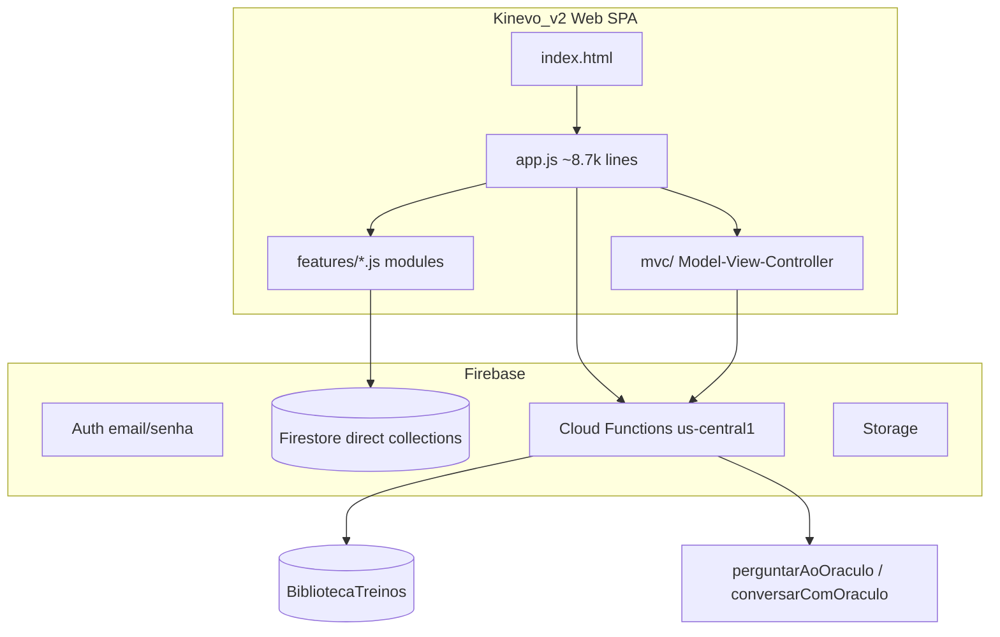

# Subagente 48312717

- **Arquivo origem:** `78936e37-018a-4828-a80e-fe8898ca70b1/subagents/48312717-4a6c-48f7-8fe6-d3712e06bed3.jsonl`
- **Exportado em:** 2026-07-08T07:50:39.566Z

---

## Usuário (1)

Explore f:\Projeto_Kinevo\Kinevo_v2 thoroughly for technical documentation. Return structured findings:

1. Stack: package.json or dependencies, frameworks (vanilla JS vs React), Firebase SDK version, key libraries
2. Folder structure: map critical business paths (features/, app.js, auth, biblioteca, periodization, dashboards)
3. Active features for trainer web: mesocycles, week duplication, division labels, volume dashboards, impersonation, laudos, biblioteca, chat, etc.
4. Firestore collections used: grep for collection(, setDoc, getDocs, doc( patterns - list collection names and typical fields
5. Technical debt: duplicated functions, missing error handling, legacy code
6. firestore.rules and firestore.indexes.json if present

Be specific with file paths and function names. Medium thoroughness.

---

## Assistente (1)

Exploring Kinevo_v2 systematically: project layout, dependencies, and Firestore usage.

---

## Assistente (2)

# Kinevo_v2 — Technical Documentation Findings

Base path: `f:\Projeto_Kinevo\Kinevo_v2`

---

## 1. Stack

**No root `package.json`.** Dev dependency only: **Playwright 1.60.0** (`f:\Projeto_Kinevo\Kinevo_v2\node_modules\.package-lock.json`). Local dev via `f:\Projeto_Kinevo\Kinevo_v2\dev.ps1` → `firebase emulators:start --only hosting`.

**Framework:** **Vanilla JS ES modules** — not React/Vue/Angular. Single-page app in `index.html` + monolithic `app.js` (~8,779 lines) with incremental **MVC** under `mvc/` (Model/View/Controller per domain).

**Firebase SDK (CDN, no bundler):**

| File | SDK version |
|------|-------------|
| `app.js`, `laudoAlunoFirestore.js`, `userProfileActions.js`, `perfilUsuario.js` | **10.8.0** |
| `features/firebaseConfig.js`, `authActions.js`, `exerciseProfileManager.js`, `taskCalendarManager.js` | **10.8.1** |
| `index.html` modulepreload | **10.8.0** |
| `anamnese.html` | **10.8.1** |
| `treino-share.html` | **10.12.2** (compat API) |

**Project:** `periodizacao-de-treinamento` — config duplicated in `app.js`, `firebaseConfig.js`, `authActions.js`.

**Key libraries (from `index.html`):**
- **Bootstrap 5** (`assets/js/bootstrap/bootstrap.bundle.min.js`)
- **jQuery** (`assets/js/jquery.min.js`)
- **ApexCharts** — volume/equilibrium dashboards (`assets/js/chart/apex-chart/apex-chart.js`)
- **FullCalendar** — task calendar (`assets/js/calendar/fullcalendar.min.js`)
- **Feather Icons, SimpleBar, Slick, Prism, Typeahead**
- **Zono admin theme** (`assets/js/script.js`, `assets/css/style.css`)

**Backend integration:**
- **Firestore, Auth, Storage, Functions** (region `us-central1`)
- Cloud Functions Callables via `f:\Projeto_Kinevo\Kinevo_v2\core\kinevoCallableGateway.js`:
  - `perguntarAoOraculo` → AI laudos/periodization
  - `conversarComOraculo` → Chat Sênior
  - `gerenciarBibliotecaTreinos` → Biblioteca CRUD
  - `gerenciarPerfisTreino` → training profiles in Biblioteca

**Global exposure pattern:** `window.db`, `window.kinevoFirestore`, `window.kinevoUid`, `window.auth` — modules share Firebase without a bundler.

---

## 2. Folder Structure (critical business paths)

```
Kinevo_v2/
├── index.html              # Main trainer SPA shell + all tab DOM
├── login.html              # Auth entry
├── app.js                  # Core orchestrator: tabs, biblioteca editor, chat, AI, ExerciciosBanco IIFE
├── kinevo-runtime.js       # Custom select UI runtime
├── sw.js                   # Service worker (PWA precache)
├── firebase.json           # Hosting + Firestore/Storage rules
├── firestore.rules
├── firestore.indexes.json
│
├── core/
│   ├── kinevoCallableGateway.js   # Cloud Functions gateway
│   └── reportResultDeps.js        # DI for ResultadoOraculoView
│
├── features/               # Side-loaded ES modules (Firestore features)
│   ├── firebaseConfig.js          # Auth guard → login.html
│   ├── authActions.js             # Login/signup → usuarios/{uid}
│   ├── userProfileActions.js      # Student profiles (perfisAlunos)
│   ├── exerciseProfileManager.js  # Assigned workouts (workouts)
│   ├── laudoAlunoFirestore.js     # Publish laudos to mobile app
│   ├── laudoAlunoHistoricoManager.js
│   ├── anamneseManager.js / anamneseAlunoAppManager.js
│   ├── taskCalendarManager.js
│   ├── whatsappMessageManager.js
│   ├── pastaDropdownManager.js    # Folder filter for AI uploads
│   ├── contextoAbas/storageContext.js  # Cross-tab clinical context (localStorage)
│   ├── biblioteca/editorState.js  # Week/exercise normalization
│   └── clinicalStateIsolation.js, performanceLaudoValidation.js, ...
│
├── mvc/
│   ├── models/    BibliotecaModel, PerformanceModel, ReabilitacaoModel, AvaliacoesModel, ...
│   ├── views/     BibliotecaView, PerformanceView, ResultadoOraculoView, ...
│   └── controllers/ BibliotecaController, PerformanceController, ...
│
├── docs/
│   └── estabilizacao-kinevo.md    # Documented duplication/legacy rules
│
└── assets/         # Zono theme, charts, CSS, bundled vendor JS
```

**Auth flow:**
1. `login.html` → `firebaseConfig.js` + `authActions.js`
2. Signup writes `usuarios/{uid}` with `role: "treinador"`
3. `index.html` guard in `firebaseConfig.js` redirects unauthenticated/anonymous users

**Periodization / Performance:** `abaPerformance` in `index.html` + `mvc/controllers/PerformanceController.js`, `PerformanceModel.js`, logic in `app.js` (`inicializarMapaVariacaoMesocicloPerformance`, `safeFnOraculo`)

**Biblioteca:** `abaBibliotecaTreinos` + `BibliotecaController`/`BibliotecaModel` — Firestore writes go through Cloud Function, not client

**Dashboards:** `mvc/views/ResultadoOraculoView.js` + `window.renderizarGraficos()` in `app.js`

---

## 3. Active Trainer Web Features

| Feature | Status | Key files / functions |
|---------|--------|----------------------|
| **Mesocycles** | Active | `inicializarMapaVariacaoMesocicloPerformance()`, `totalMesociclos`, `variacaoPorMesociclo`, `metodos_direcionadores_por_mesociclo` in `PerformanceModel.js`; exercise fields `fase`, `mesociclo_label`, `semana_num` |
| **Week duplication** | Active | `adicionarSemanaPorCopia()`, `excluirSemanaSelecionada()` in `app.js` (~L2903–2958); UI buttons `data-action="adicionarSemana"` / `"excluirSemana"` |
| **Division labels** | Active | `_kinevoRotulosDivisao`, `_rotuloDivisao()`, `_renomearDivisaoModal()`, persisted in `localStorage` key `kinevo_rotulos_divisao_v1` (`app.js` ~L1975–2138) |
| **Volume dashboards** | Active | Backend returns `json.dashboards`; `ResultadoOraculoView` renders Volume + Equilíbrio Muscular via `window.renderizarGraficos()`; Biblioteca editor has `_renderizarGraficoVolume()` + toggle `_kinevoVolumeModoGrafico` |
| **Impersonation** | **Not in web UI** | Only in `firestore.rules` for `historicoTreinos` (“modo presencial” — mobile/trainer writes on behalf of student). No web grep hits for impersonation |
| **Laudos** | Active | AI generation via `safeFnOraculo()`; publish to app via `publicarLaudoAlunoNoApp()` in `laudoAlunoFirestore.js`; tabs Avaliações / Reabilitação |
| **Biblioteca de Treinos** | Active | `chamarBibliotecaTreinos()`, visual editor, `duplicateTreino()`, share links, export Performance→Biblioteca (`prepararFichaBibliotecaFromPerformance`) |
| **Biblioteca de Exercícios** | Active | IIFE in `app.js` (~L8080+): `ExerciciosBanco/{uid}/exercicios` |
| **Chat Sênior** | Active | `window.enviarMensagemChat()` → `fnChat()` → `conversarComOraculo`; per-tab history `_obterHistoricoChatDaAba()`; context badge in UI |
| **Student profiles** | Active | `userProfileActions.js` → `perfisAlunos`; tabs `abaPerfil`, `abaEditarUsuario` |
| **Anamnese digital** | Active | `anamneseManager.js` + public `anamnese.html`; `anamneseAlunoAppManager.js` links to student profiles |
| **WhatsApp templates** | Active | `whatsappMessageManager.js` → `mensagensWhatsApp`; publishes `mensagemTreinador` on `perfisAlunos` |
| **Tasks / Calendar** | Active | `taskCalendarManager.js` → `tarefas` + FullCalendar |
| **Cross-tab clinical context** | Active | `storageContext.js` — Reabilitação/Avaliações → Performance sync |
| **Edição em massa (séries/reps)** | Active | Biblioteca editor in `app.js` (~L3249+); smoke checklist item #8 |
| **MVC migration flags** | Active | `globalThis.__KINEVO_MVC_* = true` for Biblioteca, Performance, Reabilitação, Avaliações, Biomecânica, Auditoria (`app.js` L174–180) |

**Sidebar tabs** (`index.html` ~L4703+): Avaliações, Reabilitação & Laudos, Performance & Treino, Análise Biomecânica, Auditoria e Progressões, Bibliotecas (Treinos/Exercícios), Personalização, Calendário, Usuários (Perfil/Edição), Tarefas, Chat.

---

## 4. Firestore Collections

### Direct client access (grep-verified)

| Collection | Access module | Typical fields |
|------------|---------------|----------------|
| **`usuarios`** | `authActions.js` | `uid`, `email`, `role: "treinador"`, `createdAt` |
| **`perfisUsuario`** | `usuario/perfilUsuario.js` | Trainer self-profile: `nome`, `cargo`, `bio`, `email`, `fotoPerfilUrl`, avatar in Storage `avatares/{uid}/` |
| **`perfisAlunos`** | `userProfileActions.js`, `laudoAlunoFirestore.js`, `whatsappMessageManager.js`, `taskCalendarManager.js`, `anamneseAlunoAppManager.js` | `ownerUid`, `id` (client id e.g. `kp_…`), `nome`, `sobrenome`, `email`, `emailMini`, `telefone`, `objetivos`, `endereco`, `foto`, `anamneseAtiva`, `mensagemTreinador`, `dataMensagemTreinador` |
| **`workouts`** | `exerciseProfileManager.js` | `ownerUid`, `studentId`, `nome`, `data`, `categoria`, `bibliotecaId`, `bibliotecaNome`, `origem`, `id`/`localId` |
| **`laudosAlunos`** | `laudoAlunoFirestore.js` | `ownerUid`, `studentId`, `titulo`, `conteudo`, `tipo` (`avaliacao`\|`reabilitacao`), `dataCriacao` |
| **`anamneses`** | `anamneseManager.js` | `ownerUid`, `publico`, `status` (`aguardando_resposta`\|`respondida`), `campos`, `perguntasCustom`, `profInfo`, `resposta`, `alunoNomeResposta`, `createdAt`, `updatedAt`, `respondidoEm` |
| **`tarefas`** | `taskCalendarManager.js` | `ownerUid`, `titulo`, `subtask`, `dataInicio`, `dataFim`, `horaInicio`, `horaFim`, `tipo`, `categoria`, `alunoId`, `alunoNome`, `obs`, `encerrada`, `lembrete`, `notify`, `mail` |
| **`mensagensWhatsApp`** | `whatsappMessageManager.js` | `ownerUid`, `titulo`, `mensagem`, `observacoes`, `categoria`, `criadoEm`, `atualizadoEm` |
| **`contasAlunos`** | `notificationService.js` (read push tokens) | `email`, `studentId`, `ownerUid`, `pushToken`, `preferenciasNotificacao`, `fotoPerfilUrl`, `termosAceitos`, `ativo` |
| **`ExerciciosBanco/{uid}/exercicios`** | `app.js` IIFE (~L8121) | `nome`, `descricao`, `grupamentos[]`, `status`, `tipoMidia`, `videoUrl`, `youtubeUrl`, `imagemUrl`, `exibirSimples`, `criadoEm`, `atualizadoEm` |

### Via Cloud Functions only (rules block client write)

| Collection | Callable | Notes |
|------------|----------|-------|
| **`BibliotecaTreinos`** | `gerenciarBibliotecaTreinos` | Read allowed for owner/student; **write: false** in rules. Actions: `list`, `get`, `create`, `update`, `archive`, `duplicate`, `delete`, `create_share_link`, `get_shared` |
| **`gerenciarPerfisTreino`** | Training profile templates inside Biblioteca (not `perfisAlunos`) |

### Rules-defined, primarily mobile (web reads indirectly)

| Collection | Fields (from rules) |
|------------|---------------------|
| **`historicoTreinos`** | `studentUid`, `studentId`, `ownerUid`, `bibliotecaId`, `sessaoId` |
| **`historicoDistancia`** | `distanciaKm`, `dataLabel`, `dataISO`, `pace`, `fcMedia`, `fcMax`, `duracaoMinutos`, `zonaEsforco`, `indiceEficiencia` |
| **`historicoPeso`** | `pesoKg`, `dataLabel`, `dataISO` |
| **`anotacoesExercicios`** | `planId`, `exerciseId`, `exercicioNome`, `texto` |
| **`recordesPessoais`** | `exercicioNome`, `category` (`strength`\|`cardio`), `pontos[]` |
| **`Artigos`** | Read-only for signed-in users |

---

## 5. Technical Debt

**Documented in `f:\Projeto_Kinevo\Kinevo_v2\docs\estabilizacao-kinevo.md`:**

| Duplicated function | Location | Risk |
|---------------------|----------|------|
| `abrirAbaProgramaticamente` | `app.js` vs `storageContext.js` | App version controls `_kinevoSkipSyncPerformanceOnce` |
| `guiarPreenchimentoPerformanceComContexto` | both | App version has fuller required-fields list |
| `extrairSecaoPorTitulo` | both | Legacy copy in `app.js` |
| `extrairDadosPacienteDoLaudo` | both | `storageContext.js` is source of truth for sync |
| `sintetizarDeficitsFlexibilidade` / `sintetizarRestricoesMobilidade` | both | Legacy NLP, not used in button export paths |
| `deduplicarLista` | `app.js` + `storageContext.js` | Same name, separate implementations |

**Firebase SDK version split (10.8.0 vs 10.8.1):**
- Comments in `laudoAlunoFirestore.js`, `userProfileActions.js`, `app.js` warn that mixing `window.db` (10.8.1 from `firebaseConfig.js`) with 10.8.0 imports **breaks `collection()`/`getDocs()`**
- `exerciseProfileManager.js` and `taskCalendarManager.js` still use `window.db` (10.8.1) — potential runtime mismatch

**Monolithic `app.js`:**
- ~8,779 lines mixing UI, Firestore, Biblioteca editor, chat, ExerciciosBanco IIFE, Performance helpers
- MVC flags enabled but large legacy surface remains (`__kinevoMostrarResultadoLegacy`, listeners “legados” ~L5530)

**Callable auth fallback:**
- `kinevoCallableGateway.js` calls `signInAnonymously()` if no user — conflicts with email-only auth guard that signs out anonymous sessions

**Security TODO in rules:**
- `perfisAlunos` `allow list: if signedIn()` — comment says move to Cloud Function before production (L70–73 in `firestore.rules`)

**Error handling patterns:**
- Many Firestore ops: `console.warn` + localStorage fallback (e.g. `userProfileActions.js`, `taskCalendarManager.js`, `whatsappMessageManager.js`)
- Some paths use bare `catch (_) {}` (e.g. cinematic metadata extraction in `app.js` ~L927)
- `alert()` used for user-facing errors in several modules

**Cache-bust fragility:**
- Imports use `?v=` query strings; `estabilizacao-kinevo.md` notes `sw.js` precache must stay in sync

**Legacy theme cruft:**
- Zono/Pixelstrap assets (`assets/js/theme-customizer/`, large `plugins.bundle.js`)

---

## 6. `firestore.rules` and `firestore.indexes.json`

**Present at:**
- `f:\Projeto_Kinevo\Kinevo_v2\firestore.rules`
- `f:\Projeto_Kinevo\Kinevo_v2\firestore.indexes.json`

**Rules summary:**
- Default deny: `match /{document=**} { allow read, write: if false; }`
- Owner model: `ownerUid == request.auth.uid` for trainer-owned docs
- Student model: `contasAlunos/{uid}` lookup for linked mobile students
- Special cases: public anamnese response updates; `BibliotecaTreinos` read-only on client; `laudosAlunos` strict field whitelist on create

**Indexes (`firestore.indexes.json`):**

```json
1. workouts:  studentId ASC + ownerUid ASC
2. anotacoesExercicios:  studentUid ASC + planId ASC
```

**Also present:** `f:\Projeto_Kinevo\Kinevo_v2\storage.rules` (referenced in `firebase.json`)

---

## Quick architecture diagram



If you want a deeper dive on any single area (e.g. Biblioteca payload schema from Cloud Functions, or full Performance form field map), say which section to expand.

---
