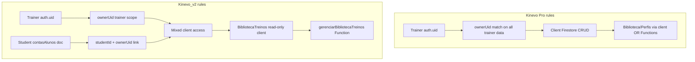

# Subagente a9f359f3

- **Arquivo origem:** `78936e37-018a-4828-a80e-fe8898ca70b1/subagents/a9f359f3-d651-441f-94ed-5f980cab6e5a.jsonl`
- **Exportado em:** 2026-07-08T07:50:39.575Z

---

## Usuário (1)

Explore f:\Projeto_Kinevo\Kinevo Pro and any firebase config in f:\Projeto_Kinevo workspace. Return:

1. firestore.rules content summary - all collections and access rules
2. firestore.indexes.json - all composite indexes
3. firebase.json, functions if any
4. Compare Kinevo_v2 vs Kinevo Pro rules differences if both exist
5. Any cloud functions or callable endpoints

List collection names, index fields, security model. Medium thoroughness.

---

## Assistente (1)

I'll scan the workspace for Firebase config and Firestore rules in Kinevo Pro and related projects.

---

## Assistente (2)

# Firebase configuration audit — `f:\Projeto_Kinevo`

Both **Kinevo Pro** and **Kinevo_v2** point to the same Firebase project: **`periodizacao-de-treinamento`** (`.firebaserc` in both). **Kinevo_Alunos** (React Native) uses the same project but has no local `firebase.json` / rules — it consumes whatever is deployed.

---

## 1. `firestore.rules` — collections & access model

### Kinevo Pro (`f:\Projeto_Kinevo\Kinevo Pro\firestore.rules`)

**Security model:** Authenticated trainers only. Almost everything is scoped by `ownerUid == request.auth.uid`. No student/`contasAlunos` model. Unlisted paths are implicitly denied (no catch-all block, but Firestore defaults to deny).

| Collection | Read | Create | Update | Delete |
|---|---|---|---|---|
| **BibliotecaTreinos** | Owner | Owner (sets own `ownerUid`) | Owner (cannot change `ownerUid`) | Owner |
| **PerfisTreino** | Owner | Owner | Owner | Owner |
| **Artigos** | Any authed user | Blocked (Admin SDK / Functions only) | Blocked | Blocked |
| **perfisAlunos** | Owner | Owner | Owner | Owner |
| **tarefas** | Owner | Owner | Owner | Owner |
| **perfisUsuario** `{uid}` | Self (`uid == auth.uid`) | Self | Self | Self |
| **usuarios** `{uid}` | Self | Self only; must set `role == "treinador"`, `uid`, `email` | Self | — |
| **workouts** | Owner | Owner | Owner | Owner |
| **laudosAlunos** | Owner only | Owner; strict field whitelist; `tipo in ['avaliacao','reabilitacao']` | Owner | Owner |

---

### Kinevo_v2 (`f:\Projeto_Kinevo\Kinevo_v2\firestore.rules`)

**Security model:** Dual role — trainers via `ownerUid`, students via `contasAlunos/{auth.uid}` lookup (`studentId`, `ownerUid`, `ativo != false`). Helper functions: `signedIn()`, `isOwnerByField()`, `createsOwnDoc()`, `isLinkedStudent()`, `isStudentWorkout()`. Explicit catch-all: **everything else denied**.

| Collection | Access summary |
|---|---|
| **anamneses** | Owner CRUD; public forms can be answered (status transition); linked students read answered forms from their trainer |
| **perfisAlunos** | Owner CRUD; **get** by email match; **list** any authed (relies on client `where` — noted TODO for Cloud Function) |
| **tarefas** | Owner CRUD |
| **mensagensWhatsApp** | Owner CRUD |
| **workouts** | Owner CRUD; **students read** their assigned workouts |
| **laudosAlunos** | Owner write/update/delete; **students read** if linked; stricter create validation (string types) |
| **contasAlunos** `{uid}` | Student self-create (first access); student limited updates (prefs, pushToken, photo, terms); trainer reads linked accounts |
| **BibliotecaTreinos** | Owner or linked student **read**; **all client writes blocked** (CRUD via Functions) |
| **historicoTreinos** | Students create own; trainer can create (presencial mode); read by student or owner; student delete; no update |
| **historicoDistancia** | Same pattern + numeric/string field validation |
| **historicoPeso** | Same pattern |
| **anotacoesExercicios** | Student CRUD own notes; trainer read via `ownerUid` |
| **recordesPessoais** | Student create/read/update/delete own; trainer read |
| **perfisUsuario** | Self read/write |
| **usuarios** | Same treinador self-registration as Pro |
| **ExerciciosBanco/{uid}/exercicios** | Self read/write (per-user exercise bank subcollection) |
| **Artigos** | Authed read; write blocked |

---

## 2. `firestore.indexes.json` — composite indexes

### Kinevo Pro (`f:\Projeto_Kinevo\Kinevo Pro\firestore.indexes.json`) — **5 indexes**

| Collection | Fields (order) |
|---|---|
| `workouts` | `ownerUid` ASC, `studentId` ASC |
| `perfisAlunos` | `ownerUid` ASC, `atualizadoEm` DESC |
| `laudosAlunos` | `studentId` ASC, `ownerUid` ASC |
| `perfisAlunos` | `ownerUid` ASC, `id` ASC |
| `tarefas` | `ownerUid` ASC, `criadoEm` DESC |

### Kinevo_v2 (`f:\Projeto_Kinevo\Kinevo_v2\firestore.indexes.json`) — **2 indexes**

| Collection | Fields (order) |
|---|---|
| `workouts` | `studentId` ASC, `ownerUid` ASC *(field order reversed vs Pro)* |
| `anotacoesExercicios` | `studentUid` ASC, `planId` ASC |

**Note:** `workouts` index field order differs between projects. Only one definition can be active per project; the other may cause query failures until merged.

---

## 3. `firebase.json` & functions layout

### Kinevo Pro (`f:\Projeto_Kinevo\Kinevo Pro\firebase.json`)

| Service | Config |
|---|---|
| **Firestore** | `database: (default)`, `location: nam5`, rules + indexes from repo root |
| **Functions** | Source: `functions/`, codebase `default`, Node 22, legacy runtime config disallowed |
| **Storage** | `storage.rules` |
| **Hosting** | `public/` with no-store headers on app shell files |

### Kinevo_v2 (`f:\Projeto_Kinevo\Kinevo_v2\firebase.json`)

| Service | Config |
|---|---|
| **Firestore** | rules + indexes only (no `location`) |
| **Functions** | **None** — no `functions` block |
| **Storage** | `storage.rules` |
| **Hosting** | `public: "."` (repo root), extra cache headers for print/share pages |
| **Emulators** | Hosting `:5000`, UI `:4000` |

**Functions package:** only at `f:\Projeto_Kinevo\Kinevo Pro\functions\`  
- `package.json`: Node 22, `firebase-functions` v7, `firebase-admin` v13  
- Entry: `index.js`

---

## 4. Kinevo Pro vs Kinevo_v2 — rules comparison

| Aspect | Kinevo Pro | Kinevo_v2 |
|---|---|---|
| **Audience** | Trainer web app only | Trainer web + student mobile (`Kinevo_Alunos`) |
| **Ownership model** | Simple `ownerUid` everywhere | `ownerUid` + `contasAlunos` student linking |
| **BibliotecaTreinos** | Full client CRUD by owner | Read-only client; writes via Cloud Function |
| **PerfisTreino** | Client CRUD by owner | **Not in rules** (would be denied by catch-all) |
| **workouts** | Owner only | Owner + linked student read |
| **laudosAlunos** | Owner-only read | Owner + linked student read |
| **perfisAlunos** | Owner-only read | Email-based get + permissive list |
| **Student collections** | None | `contasAlunos`, `historico*`, `anotacoesExercicios`, `recordesPessoais` |
| **Trainer-only extras in v2** | — | `anamneses`, `mensagensWhatsApp`, `ExerciciosBanco/{uid}/exercicios` |
| **Catch-all deny** | Implicit | Explicit `/{document=**}` deny |
| **Storage rules** | Any authed read/write on all paths | Only `fotosPerfil/{uid}.jpg` write by owner |

**Deployment risk:** Both deploy to the **same** Firebase project with **different** rules, indexes, and storage rules. Whichever is deployed last wins for Firestore/Storage policy.

---

## 5. Cloud Functions & callable endpoints

All defined in `f:\Projeto_Kinevo\Kinevo Pro\functions\index.js`. Region used by clients: **`us-central1`**.

| Export | Type | Auth | Purpose |
|---|---|---|---|
| **`lerArtigoNovo`** | Storage trigger (`onObjectFinalized`) | N/A (backend) | PDF upload → extract text → embed → write chunks to **`Artigos`** |
| **`perguntarAoOraculo`** | Callable (`onCall`) | **Required** (`assertAuth`) | AI workout/plan generation (RAG over `Artigos`); 4GiB, 540s timeout |
| **`gerenciarBibliotecaTreinos`** | Callable | **Required** | CRUD on **`BibliotecaTreinos`** via Admin SDK. Actions: `create`, `update`, `archive`, `delete`, `duplicate`, `create_share_link`, `get_shared`, `get`, `list` (default) |
| **`gerenciarPerfisTreino`** | Callable | **Required** | CRUD on **`PerfisTreino`**. Actions: `create`, `update`, `archive`, `delete`, `list` |
| **`conversarComOraculo`** | Callable | **Required** | Chat with RAG context (`historico`, `pergunta`, `contextoTela`) |
| **`getTreinoCompartilhado`** | Callable | **None** (public) | Lookup shared workout by `shareToken` where `shareEnabled == true` |

### Client usage

Both web apps use the same gateway (`kinevoCallableGateway.js`):

- `fnOraculo` → `perguntarAoOraculo`
- `fnChat` → `conversarComOraculo`
- `fnBiblioteca` → `gerenciarBibliotecaTreinos`
- `fnPerfis` → `gerenciarPerfisTreino`

**Kinevo_v2** also calls `getTreinoCompartilhado` directly from `treino-share.html`.

**Kinevo_Alunos** does not call Cloud Functions — direct Firestore only (aligned with v2 rules).

Gateway behavior: if no user, signs in **anonymously** before calling (except `getTreinoCompartilhado` which bypasses the gateway).

---

## Security model summary

**Collections touched by Functions (Admin SDK, bypass rules):** `Artigos`, `BibliotecaTreinos`, `PerfisTreino`.

---

## File paths reference

| Asset | Kinevo Pro | Kinevo_v2 |
|---|---|---|
| Rules | `f:\Projeto_Kinevo\Kinevo Pro\firestore.rules` | `f:\Projeto_Kinevo\Kinevo_v2\firestore.rules` |
| Indexes | `f:\Projeto_Kinevo\Kinevo Pro\firestore.indexes.json` | `f:\Projeto_Kinevo\Kinevo_v2\firestore.indexes.json` |
| Firebase config | `f:\Projeto_Kinevo\Kinevo Pro\firebase.json` | `f:\Projeto_Kinevo\Kinevo_v2\firebase.json` |
| Functions | `f:\Projeto_Kinevo\Kinevo Pro\functions\` | — |
| Storage rules | `f:\Projeto_Kinevo\Kinevo Pro\storage.rules` | `f:\Projeto_Kinevo\Kinevo_v2\storage.rules` |

---
