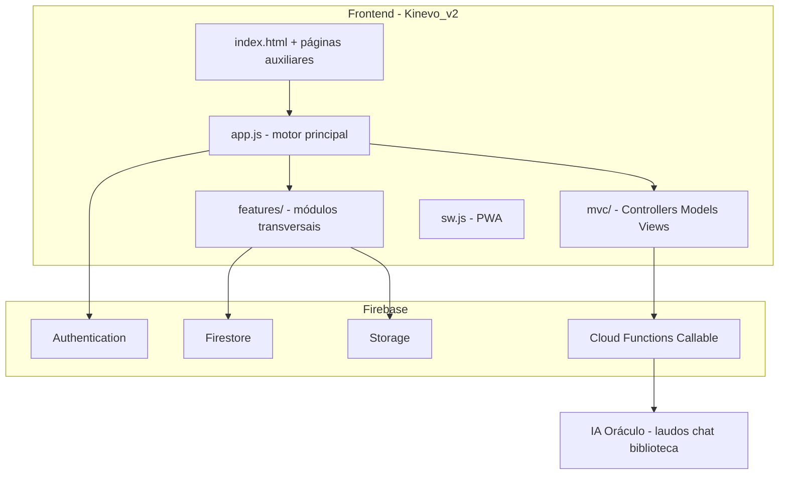

# Subagente 985d7a70

- **Arquivo origem:** `c0b016ef-02da-473a-810f-976119a8fa1f/subagents/985d7a70-3f88-48c1-bdaa-4501730b92b0.jsonl`
- **Exportado em:** 2026-07-16T18:39:46.734Z

---

## Usuário (1)

Explore the directory f:\Projeto_Kinevo\Kinevo_v2 thoroughly. This appears to be a PHP/web project. I need to understand:
1. Overall project structure (main folders and files)
2. What the application does (purpose/domain)
3. Tech stack (PHP framework, database, frontend)
4. Key entry points, config files, routing
5. Main modules/features

Read key files like index.php, config files, composer.json if exists, any main PHP files. Return a comprehensive summary in Portuguese.

---

## Assistente (1)

Vou explorar a estrutura do projeto Kinevo_v2 e ler os arquivos principais para montar o resumo.

---

## Assistente (2)

Não há PHP nem `composer.json` — parece ser uma aplicação web JavaScript. Vou mapear a estrutura e os arquivos de entrada.

---

## Assistente (3)

# Análise completa de `f:\Projeto_Kinevo\Kinevo_v2`

## Observação importante

**Este projeto não é uma aplicação PHP.** Não há `composer.json`, `index.php` nem backend PHP ativo. O Kinevo_v2 é uma **SPA (Single Page Application) em JavaScript** hospedada no **Firebase Hosting**.

Existem apenas **2 arquivos PHP legados** do template admin **Zono/DataTables**, sem integração com a lógica principal:

- `f:\Projeto_Kinevo\Kinevo_v2\assets\ajax\server-processing.php`
- `f:\Projeto_Kinevo\Kinevo_v2\assets\ajax\post.php`

---

## 1. Estrutura geral do projeto

### Raiz (`Kinevo_v2/`)

| Arquivo/Pasta | Função |
|---|---|
| `index.html` | Painel principal (~7.500 linhas: UI + formulários de todas as abas) |
| `app.js` | Motor principal da aplicação (~7.300 linhas) |
| `kinevo-runtime.js` | Runtime de UI (custom selects, widgets) |
| `sw.js` | Service Worker (PWA, cache offline) |
| `login.html` | Tela de autenticação |
| `anamnese.html` / `anamnese-print.html` | Formulário público de anamnese + impressão |
| `kinevo-print.html` | Impressão de laudos/relatórios |
| `treino-share.html` | Visualização pública de ficha de treino compartilhada |
| `404.html` | Página de erro |
| `firebase.json` | Config de deploy (Hosting + Firestore rules) |
| `firestore.rules` | Regras de segurança do Firestore |
| `app.webmanifest` | Manifest PWA |
| `icons/` | Ícones do app instalável |

### Código da aplicação

| Pasta | Conteúdo |
|---|---|
| `mvc/controllers/` | 7 controllers (Biblioteca, Performance, Reabilitação, Avaliações, Biomecânica, Auditoria, Personalização) |
| `mvc/models/` | 8 models (lógica de negócio + chamadas à IA/backend) |
| `mvc/views/` | 8 views (renderização de resultados e UI MVC) |
| `mvc/utils/` | Utilitários (pose/MoveNet, MIME types, metadados) |
| `features/` | Módulos transversais (auth, anamnese, WhatsApp, calendário, contexto entre abas, etc.) |
| `core/` | Gateway para Cloud Functions + dependências de relatórios |
| `assets/` | Template Zono (Bootstrap 5, CSS, JS, imagens, CKEditor, ApexCharts, FullCalendar) |
| `docs/` | Documentação interna (`estabilizacao-kinevo.md`) |
| `.cursor/rules/` | Regras de desenvolvimento do projeto |
| `node_modules/` | Apenas Playwright (dev/test) |

---

## 2. Propósito e domínio

**Kinevo PRO** é uma **plataforma de inteligência clínica e periodização de treinamento** voltada a profissionais de saúde/fitness (fisioterapeutas, preparadores físicos, etc.).

Principais capacidades:

- **Gerar laudos clínicos com IA** (módulo “Oráculo”) a partir de formulários estruturados
- **Avaliações fisiológicas** com análise visual (simetrógrafo, landmarks de pose)
- **Reabilitação e laudos** com parecer técnico e versão simplificada para paciente
- **Performance e periodização de treino** com gráficos, exportação PDF e “periodização livre”
- **Análise biomecânica** com detecção de pose (MoveNet) e trilhos anatômicos
- **Auditoria e progressões** de planos de treino
- **Biblioteca de treinos** com editor visual (semanas/dias, edição em massa, dieta)
- **Anamnese digital** (formulário público para alunos responderem)
- **Chat assistente “Sênior”** contextualizado com laudos/tabelas da tela
- **WhatsApp híbrido** (mensagens assistidas + tarefas no calendário)
- **Gestão de perfis de alunos**, tarefas e personalização da interface

O projeto Firebase é `periodizacao-de-treinamento`.

---

## 3. Stack tecnológica

### Frontend
- **HTML5 + JavaScript ES Modules** (sem bundler; imports diretos via CDN)
- **Bootstrap 5** + template admin **Zono** (Pixelstrap)
- **jQuery** (legado do template Zono)
- **ApexCharts** — gráficos de Performance
- **FullCalendar** — calendário de tarefas
- **CKEditor** — editor rich text (template)
- **TensorFlow.js / MoveNet** — detecção de pose biomecânica
- **PWA** com Service Worker (`sw.js`)
- **Capacitor** (import map para app mobile híbrido)

### Backend / Infraestrutura
- **Firebase Authentication** (e-mail/senha; sessão anônima só para Callables)
- **Cloud Firestore** — dados persistentes
- **Firebase Storage** — upload de mídias/PDFs/vídeos
- **Firebase Cloud Functions (Callable, região `us-central1`)**:
  - `perguntarAoOraculo` — geração de laudos/análises
  - `conversarComOraculo` — chat assistente
  - `gerenciarBibliotecaTreinos` — CRUD da biblioteca
  - `gerenciarPerfisTreino` — perfis de treino
- **Firebase Hosting** — deploy estático

### Banco de dados (Firestore)
Coleções definidas em `firestore.rules`:
- `anamneses`, `perfisAlunos`, `tarefas`, `mensagensWhatsApp`, `workouts`, `perfisUsuario`, `Artigos` (somente leitura)

### O que **não** existe
- PHP/Laravel/Symfony como backend
- `composer.json` / `package.json` na raiz (só Playwright em `node_modules`)
- Roteamento server-side tradicional

---

## 4. Pontos de entrada, configuração e “roteamento”

### Pontos de entrada

| Página | Papel |
|---|---|
| `login.html` | Login → redireciona para `index.html` |
| `index.html` | App principal (requer auth) |
| `anamnese.html` | Formulário público (token/ID na URL) |
| `treino-share.html` | Ficha compartilhada por token |
| `*-print.html` | Versões para impressão/PDF |

### Arquivos de configuração

| Arquivo | Função |
|---|---|
| `firebase.json` | Hosting, headers de cache, regras Firestore |
| `firestore.rules` | Segurança por `ownerUid` |
| `features/firebaseConfig.js` | Inicialização Firebase + **guard de rota** (sem auth → `login.html`) |
| `app.js` (linhas 97–104) | Config Firebase duplicada + init de Auth/Functions |
| `.gitignore` | Ignora `node_modules`, `.firebase`, `.firebaserc`, `.env` |

### Roteamento

Não há router SPA (React Router, etc.). O “roteamento” é:

1. **Multi-page**: páginas HTML separadas (`login.html`, `anamnese.html`, etc.)
2. **Abas no `index.html`**: navegação por `window.abrirAba()` / `abrirAbaProgramaticamente()` trocando `.tab-content.active`
3. **Atributos `data-kinevo-tab`** no menu lateral para identificar abas

Fluxo de boot em `index.html`:
```
kinevo-runtime.js → app.js (module) → firebaseConfig.js → features/*.js → sw.js
```

---

## 5. Módulos e funcionalidades principais

### Arquitetura MVC (frontend)

Cada módulo clínico segue **Model → View → Controller**, instanciados em `app.js` (~linha 5998):

| Módulo | Responsabilidade |
|---|---|
| **Avaliações** | Laudos de avaliação fisiológica, simetrógrafo, mídia |
| **Reabilitação & Laudos** | Laudo clínico completo + relatório para paciente |
| **Performance & Treino** | Periodização, gráficos Volume/Equilíbrio, export PDF |
| **Análise Biomecânica** | Pose + trilhos anatômicos em imagens/vídeos |
| **Auditoria e Progressões** | Revisão de planos, red flags, correções |
| **Biblioteca de Treinos** | CRUD de fichas, editor semanal, share link, vídeos |
| **Personalização** | Ocultar/mostrar campos e opções do formulário |

### Features transversais (`features/`)

| Módulo | Função |
|---|---|
| `contextoAbas/storageContext.js` | Sincroniza dados entre abas (ex.: Reabilitação → Performance) via `localStorage` |
| `performanceLaudoValidation.js` | Valida respostas da IA |
| `clinicalCrossCheckManager.js` | Cruzamento clínico antes de gerar laudos |
| `laudoAnteriorManager.js` | Importação de laudos anteriores (.txt/.pdf) |
| `anamneseManager.js` | Geração/importação de anamnese com IA |
| `biblioteca/editorState.js` | Estado do editor de treinos (semanas, deduplicação) |
| `whatsappMessageManager.js` | Central WhatsApp + Firestore |
| `taskCalendarManager.js` | Calendário de tarefas |
| `pastaDropdownManager.js` | Organização por pastas de pacientes |
| `headerProfileManager.js` / `usuario/perfilUsuario.js` | Perfil do profissional/aluno |

### Core (`core/`)

- `kinevoCallableGateway.js` — único ponto de chamada às Cloud Functions
- `reportResultDeps.js` — dependências injetadas para renderização de resultados

### Chat “Sênior”

Assistente flutuante em `app.js` que envia contexto da tela (laudo, tabelas, treino) para `conversarComOraculo`.

### Integração entre abas

Documentada em `docs/estabilizacao-kinevo.md`: há funções duplicadas entre `app.js` e `storageContext.js` — fluxo crítico Reabilitação/Avaliações → Performance.

---

## Diagrama simplificado da arquitetura



---

## Resumo executivo

O **Kinevo_v2** é um **PWA clínico-esportivo** em JavaScript puro, com UI baseada no template **Zono/Bootstrap 5**, backend **100% Firebase** (sem PHP ativo), e arquitetura **MVC no frontend**. A IA roda via **Cloud Functions Callable** (“Oráculo”) para gerar laudos, periodizações, chat e gestão da biblioteca de treinos.

Se você esperava um projeto PHP, pode ser que a versão anterior ou outro diretório em `f:\Projeto_Kinevo` contenha esse código — dentro de `Kinevo_v2` especificamente, o núcleo é JavaScript + Firebase.

Quer que eu explore também o restante de `f:\Projeto_Kinevo` (fora de `Kinevo_v2`) em busca de código PHP ou Cloud Functions?

---
